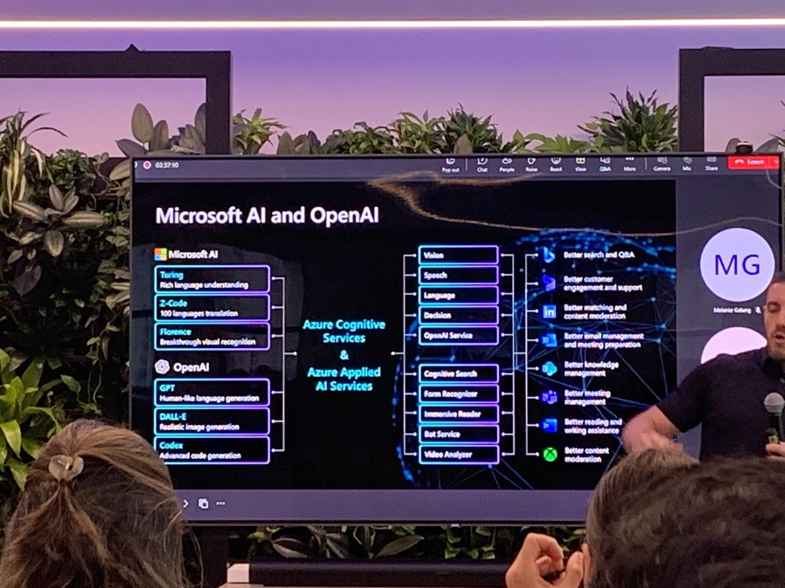

## 最近一年

思考以下最近一年做了什么事，好像什么也没做，参加了个黑客松拿了个奖，日子过的还算不错.

> 朋友现场拍的，2b微软日常推销

我这人喜欢安静，所以就没去现场了，在家写的 code.

今年暑假准备计划申请转学了，不知道 NYU tandon 能不能要我 ！带了个 `TA + 黑客松`的经历，不知道有没有机会。

代码没写多少，主要时间花在构思以后想干嘛了，不过构思是不能花太多时间的，暑假打算开始开坑我的 UE5 !

## Final
现在是5月17日02点22分，凌晨的2点，弄Final，平时不努力，期末就要熬夜了，不过这次还好，大一的课不难，难也难不到哪里去。

但是估计成绩不是很理想，因为我的目标不是pass，目标是拿一个不错的GPA，所以相对不是很理想了，申请转学要用的。

## 暑假计划

开整 UE5 ！不是很想把大学的时间花在做App上，做Crud，做前端上，这些东西在我看来是useless。可能是长大了，心态转变了

从因为各种技术的酷炫名称到现在只想做自己的东西，技术能简洁，能简单，就往这个方向去做，而不是将一个系统设计的特别复杂。

准备开始捡起 Ue5，希望以后能跟好朋友做一款属于自己的游戏！饿死也要用爱发电！反正还有好几年的大学时间可以霍霍，随便霍霍，做自己想做的事情。
