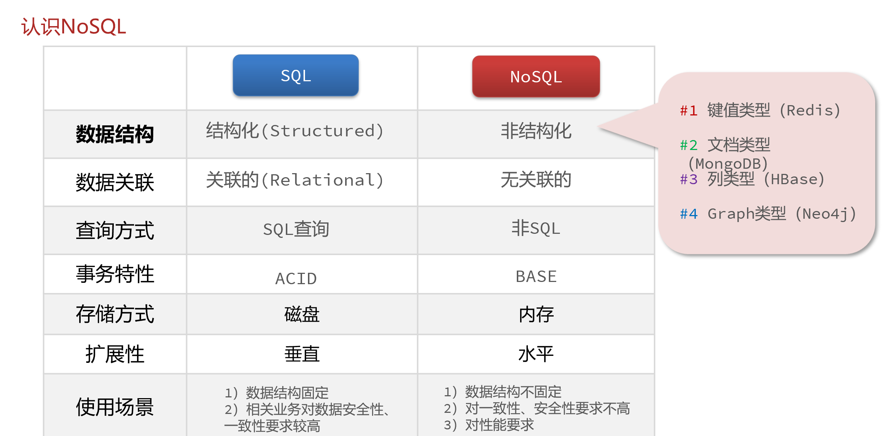

:::tip 提示
本教程是基于 Linux CentOS7 系统进行安装

在安装之前需要对 Linux 系统进行网络服务，防火墙等设置更改
:::
[[TOC]]

## SQL vs NoSQL

> SQL 是关系型数据库，NoSQL 是非关系型数据库



### Redis 特点

Redis是一个基于内存的 `Key Value`的 NoSQL 数据库

- 键值（key-value）型，value支持多种不同数据结构，功能丰富
- 单线程，每个命令具备原子性
- 低延迟，速度快（基于内存、IO多路复用、良好的编码）
- 支持数据持久化
- 支持主从集群、分片集群
- 支持多语言客户端

## 安装 Redis 

### 系统配置

Linux 版本 CentOS7

### 安装依赖库

Redis是基于C语言编写的，因此首先需要安装Redis所需要的gcc依赖：

```sh
# 安装环境
yum install -y centos-release-scl scl-utils-build devtoolset-8-toolchain gcc-c++
# 开启 devtoolset-8
scl enable devtoolset-8 bash
# 测试gcc版本
gcc --version
```

### 上传与解压

下载 redis-6.2.6.tar.gz 放到任意目录

例如 /usr/local/src
```sh
cd /usr/local/src
```
**解压**

```sh
tar -xzf redis-6.2.6.tar.gz
```

进入 redis 目录

```sh
cd redis-6.2.6
```

运行编译命令：

```sh
make && make install
```

如果没有出错，应该就安装成功了。

默认的安装路径是在 `/usr/local/bin` 目录下：

该目录以及默认配置到环境变量，因此可以在任意目录下运行这些命令。其中：

- redis-cli：是redis提供的命令行客户端
- redis-server：是redis的服务端启动脚本
- redis-sentinel：是redis的哨兵启动脚本

## 启动Redis

redis 的启动方式有很多种，例如：

- 默认启动
- 指定配置启动
- 开机自启


### 前台启动

安装完成后，在任意目录输入`redis-server`命令即可启动 Redis

```sh
redis-server
```

前台启动会阻塞整个会话窗口，窗口关闭或者按下`CTRL + C`则 Redis 停止。不推荐使用。

### 后台启动

如果要让 Redis 以`后台`方式启动，则必须修改Redis配置文件，就在之前解压的 redis 安装包下（`/usr/local/src/redis-6.2.6`），名字叫 redis.conf

先将这个配置文件备份一份防止操作失误

```sh
cp redis.conf redis.conf.bck
```

然后修改 redis.conf 文件中的一些配置：

```properties
# 允许访问的地址，默认是127.0.0.1，会导致只能在本地访问。修改为0.0.0.0则可以在任意IP访问，生产环境不要设置为0.0.0.0
bind 0.0.0.0
# 守护进程，修改为yes后即可后台运行
daemonize yes 
# 密码，设置后访问Redis必须输入密码
requirepass 123456
```

Redis 的其它常见配置：

```properties
# 监听的端口
port 6379
# 工作目录，默认是当前目录，也就是运行redis-server时的命令，日志、持久化等文件会保存在这个目录
dir .
# 数据库数量，设置为1，代表只使用1个库，默认有16个库，编号0~15
databases 1
# 设置redis能够使用的最大内存
maxmemory 512mb
# 日志文件，默认为空，不记录日志，可以指定日志文件名
logfile "redis.log"
```

启动 Redis ：

```sh
# 进入redis安装目录 
cd /usr/local/src/redis-6.2.6
# 启动
redis-server redis.conf
```

停止服务：

```sh
# 利用redis-cli来执行 shutdown 命令，即可停止 Redis 服务，
# 因为之前配置了密码，因此需要通过 -u 来指定密码
redis-cli -u 123456 shutdown
```

### 开机自启

可以通过配置来实现开机自启。

首先，新建一个系统服务文件：

```sh
vi /etc/systemd/system/redis.service
```

内容如下：

```conf
[Unit]
Description=redis-server
After=network.target

[Service]
Type=forking
ExecStart=/usr/local/bin/redis-server /usr/local/src/redis-6.2.6/redis.conf
PrivateTmp=true

[Install]
WantedBy=multi-user.target
```


然后重载系统服务：

```sh
systemctl daemon-reload
```


现在，可以用下面这组命令来操作 redis 了：

```sh
# 启动
systemctl start redis
# 停止
systemctl stop redis
# 重启
systemctl restart redis
# 查看状态
systemctl status redis
```


执行下面的命令，可以让 redis 开机自启：

```sh
systemctl enable redis
```

## 图形界面Redis

GitHub上的大神编写了 Redis 的图形化桌面客户端，[点我跳转](https://github.com/uglide/RedisDesktopManager)

不过该仓库提供的是 RedisDesktopManager 的源码，并未提供 windows 安装包。

在下面这个仓库可以找到安装包，[点我跳转](https://github.com/lework/RedisDesktopManager-Windows/releases)