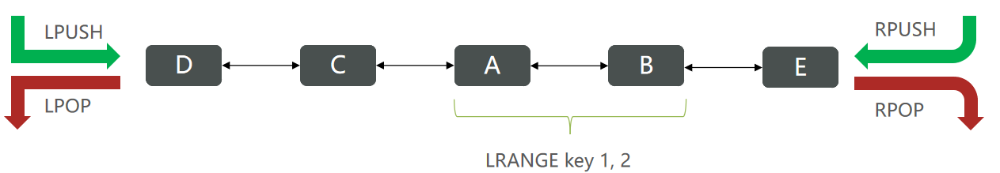

::: tip
Redis是一个 Key-Value 的数据库，key 一般是 String 类型，不过类型多种多样。
:::

[[TOC]]

## 八大数据类型


## 帮助文档

1. 在官方文档可查询，[点击跳转](https://redis.io/commands/?group=string)。

2. 启动 redis-cli 登录之后 使用 help 指令查看得出结果。

```sh
To get help about Redis commands type:
      "help @<group>" to get a list of commands in <group>
      "help <command>" for help on <command>
      "help <tab>" to get a list of possible help topics
      "quit" to exit

To set redis-cli preferences:
      ":set hints" enable online hints
      ":set nohints" disable online hints
```

## Key 的层级格式

在 Redis 中，数据是以键值对的形式存在，

与 MySQL 不同的是，Redis 没有 Table 的概念，

那么 Keys 必须为唯一，因此！大多数的 Key 都是以 id的形式。

在一个业务常见中，用户和商品的信息用到 redis，那么用户的 id 是1，商品的 id 也是1。

Key 将允许由多个单词形成层级结构 多个单词用：隔开。

模范示例，具体取决于团队的标准。
```sh 
ProjectName:ModuleName:Type:id

# Example
kaibutsusama:user:1
kaibutsusama:product:1
```

### Java对象

如果Value是一个Java对象，例如一个User对象，则可以将对象序列化为JSON字符串后存储：

|       KEY       |                    VALUE                     |
|:---------------:|:--------------------------------------------:|
|  heima:user:1   | {"id":1, "name": "KaibutsuSama", "age": 20}  |
| heima:product:1 | {"id":1, "name": "Iphone11", "price": 10899} |


## 常见通用命令

通用命令是部分数据类型都可以使用的命令。

::: tip 查看所有通用命令
```sh
help @generic
```
:::

### KEYS

KEYS: 查看符合模板的所有 key

因为是通配符查找，所以底层是`模糊查找`，且 Redis 为`单线程`，在数据量过大如百万数据量时使用 KEYS 查找，在搜索时间内可能造成`整个Redis的服务堵塞`。

但如果 Redis 是一个`集群模式`下，有主有从，那么在`从节点`上执行 KEYS 命令，其实也还可以，`别在主节点运行`即可。

:::danger 官方文档
consider KEYS as a command that should only be used in production environments with extreme care. It may ruin performance when it is executed against large databases. This command is intended for debugging and special operations, such as changing your keyspace layout. Don't use KEYS in your regular application code. If you're looking for a way to find keys in a subset of your keyspace, consider using SCAN or sets.
:::

**Example**
```sh
redis:6379> MSET firstname Jack lastname Stuntman age 35
"OK"
redis:6379> KEYS *name*
1) "firstname"
2) "lastname"
redis:6379> KEYS a??
1) "age"
redis:6379> KEYS *
1) "firstname"
2) "lastname"
3) "age"
redis:6379> 
```

### DEL

DEL: 删除一个指定的 Key

:::tip 官方文档
Removes the specified keys. A key is ignored if it does not exist.
:::

如果批量删除一堆存在和不存在的 KEY，那么删除能够进行成功，并且会 Return 一个 integer

Integer reply: The number of keys that were removed.

**example**
```sh
redis:6379> SET key1 "Hello"
"OK"
redis:6379> SET key2 "World"
"OK"
redis:6379> DEL key1 key2 key3
(integer) 2
redis:6379> 
```

### EXISTS

EXISTS: 判断一个 Key 是否存在

:::tip 官方文档
The user should be aware that if the same existing key is mentioned in the arguments multiple times, it will be counted multiple times. So if somekey exists, EXISTS somekey somekey will return 2.
:::

Integer reply, specifically the number of keys that exist from those specified as arguments.

**Example**
```sh
redis:6379> SET key1 "Hello"
"OK"
redis:6379> EXISTS key1
(integer) 1
redis:6379> EXISTS nosuchkey
(integer) 0
redis:6379> SET key2 "World"
"OK"
redis:6379> EXISTS key1 key2 nosuchkey
(integer) 2
redis:6379> 
```

### EXPIRE & TTL

EXPIRE: 给 Key 设置一个有效期，到期后该 Key 会自动删除。
TTL： 查询 Key 的有效期
因为 Redis 将内存存储在内存里，不到期删除内存迟早会满，因此需要 EXPIRE。

EXPIRE 的 Integer reply 如果为1，那么就是设置成功，如果为0，未设置成功。
TTL 的 Integer reply 如果为-1，那么就是永久有效。

**Example**
```sh
redis:6379> SET mykey "Hello"
"OK"
redis:6379> EXPIRE mykey 10
(integer) 1
redis:6379> TTL mykey
(integer) 10
redis:6379> SET mykey "Hello World"
"OK"
redis:6379> TTL mykey
(integer) -1
redis:6379> EXPIRE mykey 10 XX
(integer) 0
redis:6379> TTL mykey
(integer) -1
redis:6379> EXPIRE mykey 10 NX
(integer) 1
redis:6379> TTL mykey
(integer) 10
redis:6379> 
```

## 数据类型使用命令

### String

String 类型，也就是字符串，最简单的数据类型。

Value 就是字符串，根据字符串的不同，又分为 3 类；

不管是哪种格式，底层都是字节数组的形式存储，编码方式不同，字符串类型最大空间不可过512m。

- String： 普通字符串
- int： 整数类型，可自增、自减操作
- float： 浮点类型，可自增、自减操作

|  KEY  |   VALUE   |
|:-----:|:---------:|
|  msg  | 你好，Redis  |
|  id   |    10     |
| money | 100000.16 |

#### String常见API

| 指令          | 含义                                        |
|-------------|-------------------------------------------|
| SET         | 添加或者修改已经存在的一个String类型的键值对                 |
| GET         | 根据key获取String类型的value                     |
| MSET        | 批量添加多个String类型的键值对                        |
| MGET        | 获得值的长度                                    |
| INCR        | 让一个整型的key自增1                              |
| INCRBY      | 让一个整型的key自增并指定步长，例如：incrby num 2 让num值自增2 |
| INCRBYFLOAT | 让一个浮点类型的数字自增并指定步长                         |
| SETNX       | 添加一个String类型的键值对，并且指定有效期                  |
| SETEX       | 设置一个或者多个 key-value 键值对                    |

### Hash

Redis hash（哈希散列）是由字符类型的 field（字段）和 value 组成的哈希映射表结构（也称散列表），它非常类似于表格结构。在 hash 类型中，field 与 value 一一对应，且不允许重复。

Redis hash 特别适合于存储对象。一个 filed / value 可以看做是表格中一条数据记录；而一个 key 可以对应多条数据。

#### Hash常见API

| 指令      | 含义                                        |
|---------|-------------------------------------------|
| HSET    | 添加或者修改hash类型key的field的值                   |
| HGET    | 获取一个hash类型key的field的值                     |
| HMSET   | 批量添加多个hash类型key的field的值                   |
| HMGET   | 批量获取多个hash类型key的field的值                   |
| HGETALL | 获取一个hash类型的key中的所有的field和value            |
| HKEYS   | 获取一个hash类型的key中的所有的field                  |
| HINCRBY | 让一个hash类型key的字段值自增并指定步长                   |
| HSETNX  | 添加一个hash类型的key的field值，前提是这个field不存在，否则不执行 |

### List

Redis List 是简单的字符串列表，按照插入顺序排序。可以看作是双向链表，可以添加一个元素到列表的头部（左边）或者尾部（右边），也就是既可以支持正向检索和也可以支持反向检索。

和 Java 中的 LinkedList 类似。

* 有序
* 元素可以重复
* 插入和删除快
* 查询速度一般

业务场景使用，例如：朋友圈点赞，评论列表等。


#### List常见API

| 指令                   | 含义                                      |
|----------------------|-----------------------------------------|
| LPUSH key element    | 向列表左侧插入一个或多个元素                          |
| LPOP key             | 移除并返回列表左侧的第一个元素，没有则返回nil                |
| RPUSH key element    | 向列表右侧插入一个或多个元素                          |
| RPOP key             | 移除并返回列表右侧的第一个元素                         |
| LRANGE key start end | 返回一段角标范围内的所有元素                          |
| BLPOP & BRPOP        | 与LPOP和RPOP类似，只不过在没有元素时等待指定时间，而不是直接返回nil |

### Set

Redis 的Set 是String 类型的无序集合。 集合成员是唯一的，这就意味着集合中不能出现重复的数据。 

集合对象的编码可以是intset 或者hashtable。 Redis 中集合是通过哈希表实现的，所以添加，删除，查找的复杂度都是O(1)。

* 无序
* 元素不可重复
* 查找快
* 支持交集.并集.差集等功能

#### Set常用API

| 指令                   | 含义              |
|----------------------|-----------------|
| SADD key member      | 向set中添加一个或多个元素  |
| SREM key member      | 移除set中的指定元素     |
| SCARD key            | 返回set中元素的个数     |
| SISMEMBER key member | 判断一个元素是否存在于set中 |
| SMEMBERS             | 获取set中的所有元素     |
| SINTER key1 key2 ... | 求key1与key2的交集   |
| SDIFF key1 key2 ...  | 求key1与key2的差集   |
| SUNION key1 key2 ... | 求key1和key2的并集   |

### SortedSet

Redis 有序集合（SortedSet）和集合（Set）一样也是 String 类型元素的集合,且`不允许重复`的 member。 

不同的是每个元素都会关联一个 `double 类型的 score`。 redis 正是通过 score 来为集合中的成员进行`从小到大`的排序。

因为 SortedSet 可排序的特性 通常用于实现 `排行榜` 这样的功能。

* 可排序
* 元素不可重复
* 查询速度快

#### SortedSet常用API

| 指令                           | 含义                                    |
|------------------------------|---------------------------------------|
| ZADD key score member        | 加一个或多个元素到sorted set ，如果已经存在则更新其score值 |
| ZREM key member              | 删除sorted set中的一个指定元素                  |
| ZSCORE key member            | 获取sorted set中的指定元素的score值             |
| ZRANK key member             | 获取sorted set 中的指定元素的排名                |
| ZCARD key                    | 获取sorted set中的元素个数                    |
| ZCOUNT key min max           | 统计score值在给定范围内的所有元素的个数                |
| ZINCRBY key increment member | 让sorted set中的指定元素自增，步长为指定的increment值  |
| ZRANGE key min max           | 按照score排序后，获取指定排名范围内的元素               |
| ZRANGEBYSCORE key min max    | 按照score排序后，获取指定score范围内的元素            |
| ZDIFF.ZINTER.ZUNION          | 求差集.交集.并集                             |

所有的排名默认都是升序，如果要降序则在命令的Z后面添加REV即可，例如：

- 升序获取sorted set 中的指定元素的排名：ZRANK key member
- 降序获取sorted set 中的指定元素的排名：ZREVRANK key memeber