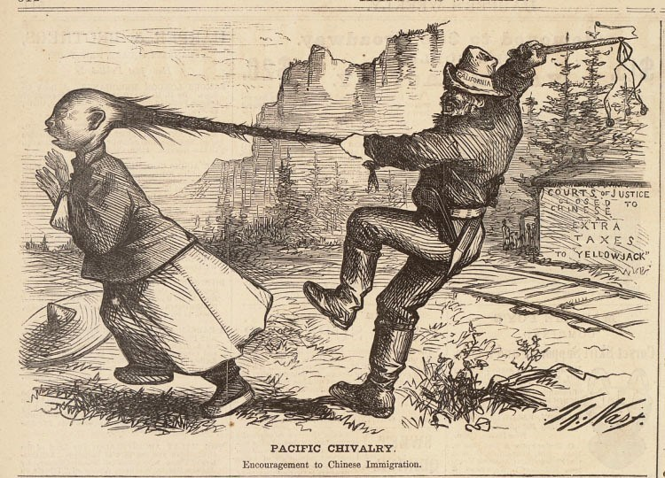
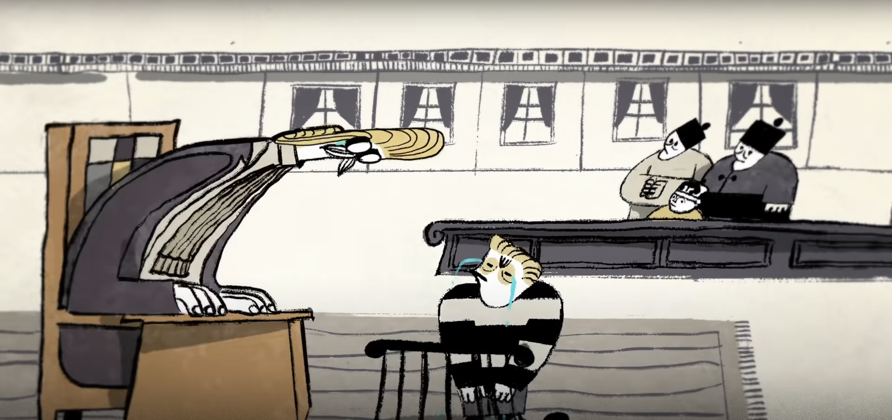
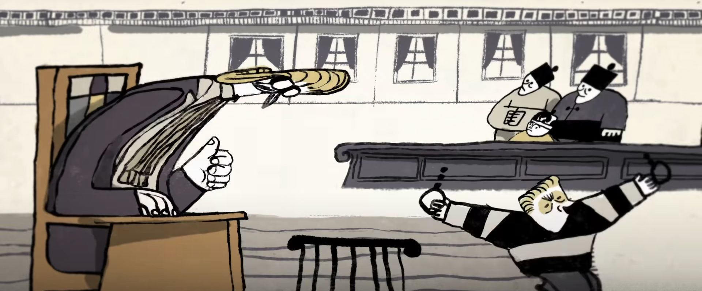
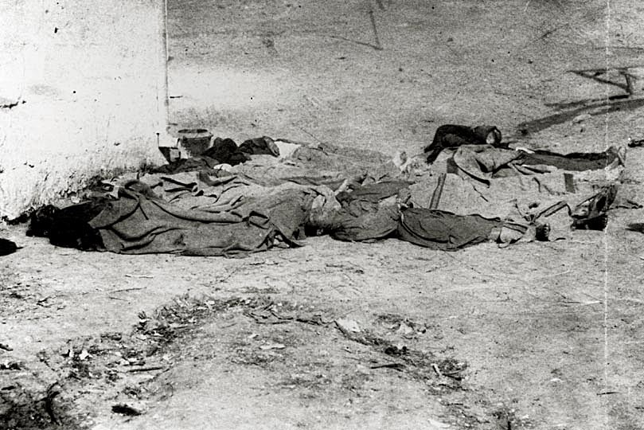
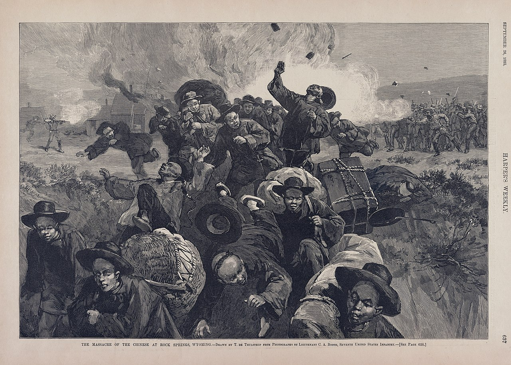

:::tip References
```bash
# Image and Statement
https://www.nytimes.com/2022/09/14/us/massacre-chinese-los-angeles-1871.html # The New York times
https://www.historyandheadlines.com/september-2-1885-the-rock-springs-massacre-this-time-chinese-are-the-scapegoats/ # Historyandheadlines

# References Video
https://www.youtube.com/watch?v=2K88pWCimZg # Ted-ed

# Data of massacre
https://www.youtube.com/watch?v=hjZmMUZgwrQ
https://en.wikipedia.org/wiki/Rock_Springs_massacre
```
:::
## Background of exclusion

In the early time of immigration, the gold rush created a huge demand for labor, and the Chinese became a popular workforce and an integral part of the surrounding communities, many of whom built railroads, dug ore, and ran laundries, restaurants, and grocery stores.

But after the success of the Chinese, American workers saw Chinese labor as a threat, believing that the Chinese were taking their jobs and lowering wage rates.

> As a result, anti-Chinese sentiment led to a plethora of vilified drawings of the Chinese.



## Violent Events

The anti-Chinese sentiment has prompted violence against the Chinese.

In 1854, a `white male` was tried for the murder of a Chinese man and the California Supreme Court overturned the verdict, holding that the Chinese citizen could not testify against the white man, who was `eventually acquitted`.

> This result was tantamount to a tacit acceptance of the legality of killing Chinese people, which led to more violence against China in the future.




### Los Angeles Chinese massacre of 1871

Prior to that, the vilification of Chinese by some newspapers created a fear of Chinese among whites, 

who in their eyes **took away jobs from whites**. This reason became the ambush for the violence.

Chinese massacre of 1871 . It was a racial vendetta against the Chinese that occurred in Los Angeles on October 24, 1871, when a mob of over 500 white males stormed Los Angeles' Chinatown to attack, rob and kill local Chinese residents. A total of 18 Chinese immigrants were killed in this massacre.



### Rock Springs massacre of 1885

Occurred on September 2, 1885, The massacre was named for the town where it took place, Rock Springs, Wyoming, in Sweetwater County, 

where white miners were jealous of the Chinese labor for their employment. 

White miners expressed their jealous frustration by ``robbing``, ``bullying``, ``shooting``, and ``stabbing`` the Chinese in Chinatown. The Chinese tried to flee but many were burned alive in their homes, starved to death in hidden refuge, by the end of the event at least twenty-eight lives had been taken.

