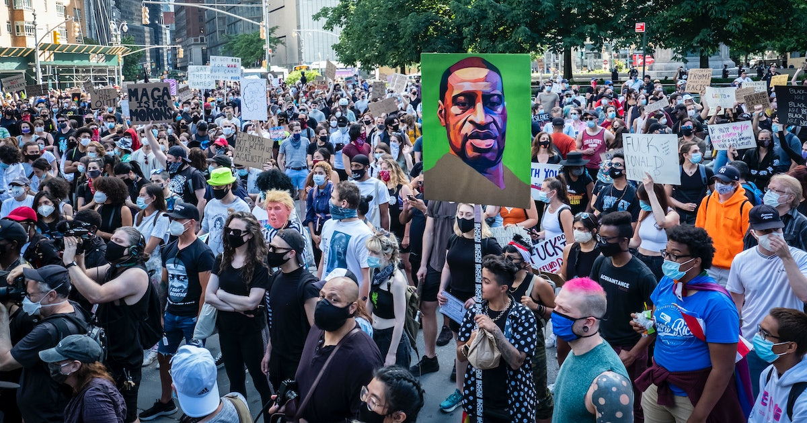
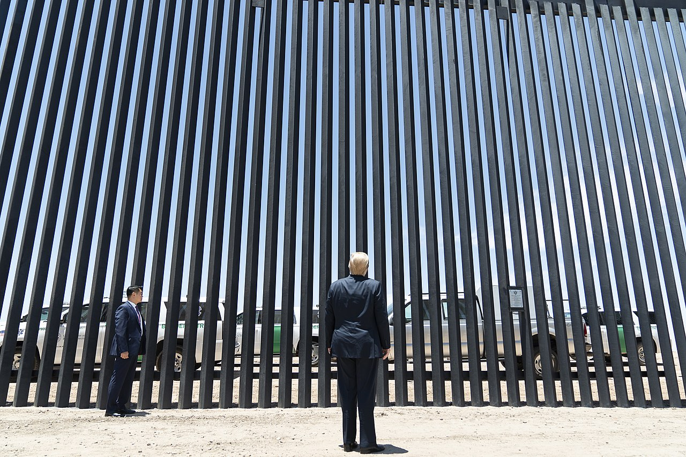

## Conclusion

### Racist

During the period of Chinese exclusion, the Chinese community suffered, such as 

1. `Violence` that resulted in the breaking up of a family, 
2. People `trashing` of Chinese stores, 
3. A white man was non-conviction for the `murder` of a Chinese man, 
4. The Page Act's `restriction` of Chinese women's entry into the U.S. making family reunification impossible; 

> These results were devastating to any community.

### In the present

Summing up the history and looking at the present, Racist is still happening around us, but its form has changed.

- 1. George Floyd

- 2. The Trump wall

### Social equality

Social equality is a state of affairs in which all people within a specific society have equal rights, liberties, and status. 

> Racist,the Slavery became a trigger for the American Civil War in the 19th century.

> Beacuse the Racism is against social equality, therefore, it is essential to ensure social equality.